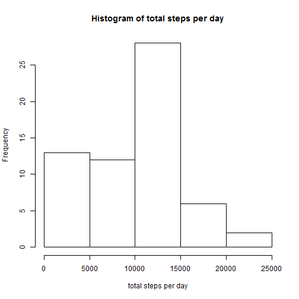
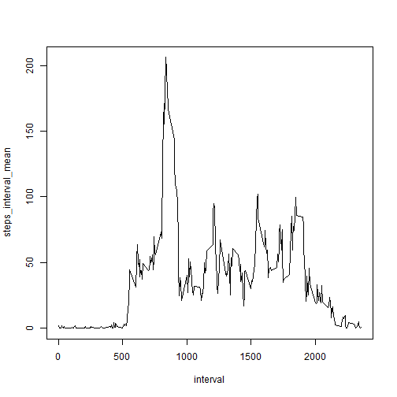
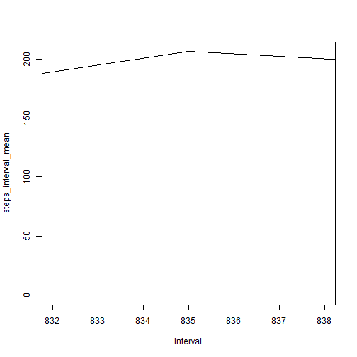

# Assignment

## Loading and preprocessing data

Loading package reading file and transforming data


```r
library(dplyr)
```


```r
file <- read.csv('activity.csv')
activity_tbl <- tbl_df(file)
```

## What is mean total number of steps taken per day?

Total number of steps taken per day

```r
steps_day <- activity_tbl %>% group_by(date) %>% summarize(steps_sum =sum(steps, na.rm=TRUE))
```
Histogram of the total number of steps taken each day

```r
hist(steps_day$steps_sum, xlab="total steps per day", main="Histogram of total steps per day")
```

 

Mean and Median

```r
mean(steps_day$steps_sum)
```

```
## [1] 9354.23
```

```r
median(steps_day$steps_sum)
```

```
## [1] 10395
```

## What is the average daily activity pattern?

Overall plot

```r
steps_interval_mean <- activity_tbl %>% group_by(interval) %>% summarize(steps_interval_mean =mean(steps, na.rm=TRUE))
with(steps_interval_mean, plot(interval, steps_interval_mean, type="l"))
```

 

A little bit closer (the answer is 835)

```r
with(steps_interval_mean, plot(interval, steps_interval_mean, type="l", xlim=c(832, 838)))
```

 

## Imputing missing values

Total number of missing values

```r
nrow(activity_tbl %>% filter(is.na(steps)))
```

```
## [1] 2304
```

Filling dataset

```r
activity_tbl_filled <- activity_tbl %>% inner_join(steps_interval_mean)
```

```
## Joining by: "interval"
```

```r
activity_tbl_filled <- activity_tbl_filled %>% mutate(steps = ifelse(is.na(steps), steps_interval_mean, steps))
```

Calculating Mean and Median

```r
steps_day_filled <- activity_tbl_filled %>% group_by(date) %>% summarize(steps_sum =sum(steps))

mean(steps_day_filled$steps_sum)
```

```
## [1] 10766.19
```

```r
median(steps_day_filled$steps_sum)
```

```
## [1] 10766.19
```

## Are there differences in activity patterns between weekdays and weekends?


```r
Sys.setlocale("LC_ALL","English")
```


```r
activity_tbl_filled <- mutate(activity_tbl_filled, steps_interval_mean=NULL)
activity_tbl_filled <- mutate( activity_tbl_filled, wday =  ifelse 
( grepl ('Saturday|Sunday', weekdays(as.Date(date)) ), 'weekend', 'weekday'))
steps_wday <- activity_tbl_filled %>% group_by(interval, wday) %>% summarize(steps_mean = mean(steps))
```

```r
library(lattice)
```

```r
xyplot(data=steps_wday, steps_mean ~ interval | wday, type="l", layout=c(1, 2), main="", ylab="Number of steps", xlab="Interval")
```

 
